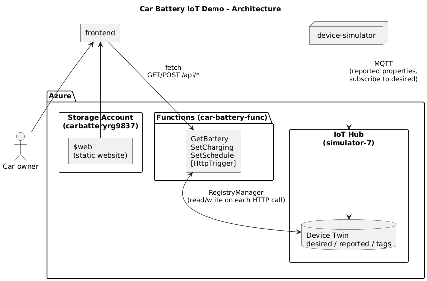
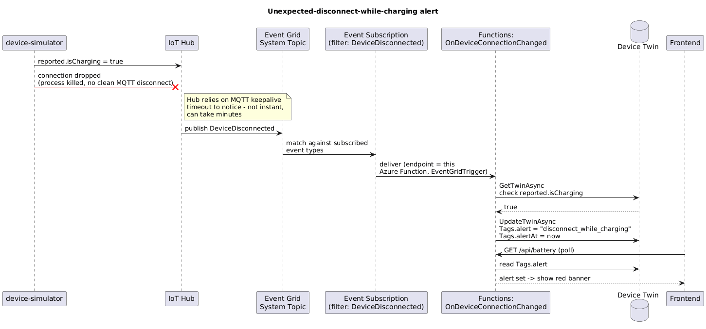

# Car Battery IoT Demo

A webpage where a car owner can see battery level / charging state, start or
stop charging, and set a daily charging schedule — backed by Azure IoT Hub, a
simulated car, and Azure Functions.

## Quickest way to look at it

**[carbatteryrg9837.z44.web.core.windows.net](https://carbatteryrg9837.z44.web.core.windows.net/)**
— a live, deployed instance, no setup needed.

Note: Start/Stop and Set Schedule write real commands to the Twin, but the
battery level only moves while `device-simulator/` is actually running
somewhere — see "Run it yourself" below for the full reactive loop.

## Architecture



- `device-simulator/` — a .NET console app playing the role of the car:
  Idle/Charging state machine, syncs with the device Twin.
- `functions/` — Azure Functions REST API translating HTTP calls into Twin
  reads/writes.
- `frontend/` — a static HTML page polling the Functions API.
- `device-simulator.Tests/`, `functions.Tests/` — xUnit tests for the pure
  logic in each.

## Beyond the brief

- Throttling retry around IoT Hub calls (`functions/RetryPolicy.cs`)
- Disconnect-while-charging alert (Event Grid + Device Twin, shown as a
  banner on the frontend)
  
- Unit tests + CI (`CarBattery.sln`, `.github/workflows/ci.yml`)


## Run it yourself

### Prerequisites
- [.NET 8 SDK](https://dotnet.microsoft.com/download)
- [Azure Functions Core Tools v4](https://learn.microsoft.com/azure/azure-functions/functions-run-local) (`npm install -g azure-functions-core-tools@4`)
- An Azure IoT Hub (free F1 tier) with one device registered (IoT Hub >
  Devices > Add Device)

### Setup

```bash
# device-simulator/.env
IOTHUB_DEVICE_CONNECTION_STRING=HostName=<hub>.azure-devices.net;DeviceId=<deviceId>;SharedAccessKey=<key>
```

```json
// functions/local.settings.json
{
  "IsEncrypted": false,
  "Values": {
    "AzureWebJobsStorage": "",
    "FUNCTIONS_WORKER_RUNTIME": "dotnet-isolated",
    "IOTHUB_SERVICE_CONNECTION_STRING": "<IoT Hub 'service' policy connection string>",
    "IOTHUB_DEVICE_ID": "<same deviceId as above>"
  },
  "Host": { "CORS": "*" }
}
```

### Run

```bash
# terminal 1
cd device-simulator && dotnet run

# terminal 2
cd functions && func start

# then open frontend/index.html in a browser
# (edit its `const API = ...` to http://localhost:7071/api first)
```
